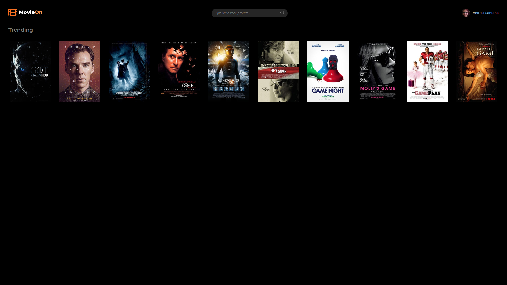

## Movie List

* Check it out
http://hideous-stage.surge.sh/


This responsive app uses the Open Movie Database API (http://www.omdbapi.com/) to return movies based on a query.

* Install dependencies with ```npm install```
* Run it with ```npm start```
* Test with ```npm test```

